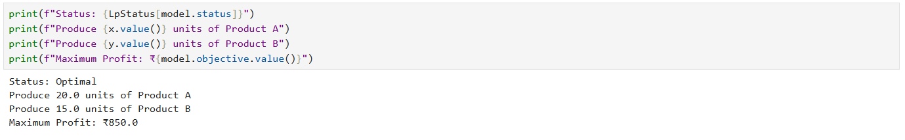

# Task-4: Optimization Using Linear Programming

## 📌 Objective
Solve a business problem using Linear Programming and Python's PuLP library.

## 🧠 Problem Statement
Maximize profit for a factory that produces two products (A and B) under resource constraints.

## 📈 Libraries Used
- `pulp` (for Linear Programming)
- `jupyter notebook`

## ✅ Solution Summary
- Decision variables: Units of Product A and B
- Objective: Maximize Profit: `20x + 30y`
- Constraints:
  - `2x + y ≤ 50`
  - `x + 2y ≤ 40`
- Optimal solution:  
  - Produce 20 units of A and 15 units of B  
  - Max profit: ₹850

## 📁 Files
- `Optimization_Task_4.ipynb`: Jupyter notebook with full code and explanation

## 🚀 How to Run
1. Clone the repo or unzip folder.
2. Run in Jupyter Notebook environment.
3. Install PuLP if needed: `pip install pulp`

---

### 🎉 Step 3: Submit!
- ✅ Push to GitHub and share the link 

### 🔍 Output Preview

